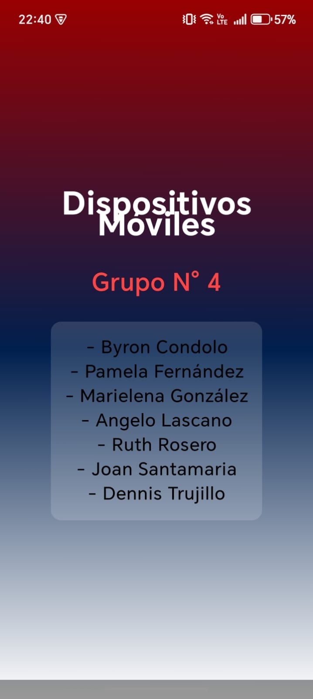

# 📱 Taller 1 – Dispositivos Móviles

**Universidad Central del Ecuador – GRUPO 4**

Este proyecto corresponde al desarrollo del **Taller 1** de la asignatura **Dispositivos Móviles**, cuyo objetivo es aplicar los fundamentos de diseño en **Android Studio** mediante la personalización de una interfaz gráfica usando **Jetpack Compose**.

La actividad consistió en:

* Aplicar los **colores institucionales de la UCE** (rojo, blanco y azul).
* Mostrar un **mensaje principal** con:

  * Nombre de la asignatura
  * Número del grupo
  * Listado de integrantes
* Organizar el contenido en una interfaz clara, funcional y estética.

## 📘 Descripción del Proyecto

El proyecto fue desarrollado en **Kotlin** utilizando **Jetpack Compose**, aplicando modificaciones en los archivos de tema (`Color.kt`, `Theme.kt`) y en el contenido de `MainActivity.kt`.

Los cambios principales incluyen:

### ✔️ Personalización del Tema

Se configuraron los colores institucionales de la UCE en:

```
/src/main/java/com/example/myapplication/ui/theme/Color.kt
```

Incluyendo:

* 🔴 **Rojo**
* ⚪ **Blanco**
* 🔵 **Azul**

Estos colores se aplican globalmente mediante `Theme.kt`.

### ✔️ Mensaje Personalizado en Pantalla

En `MainActivity.kt` se muestra:

* **Asignatura:** Dispositivos Móviles
* **Grupo:** GRUPO 4
* **Integrantes:** Listados en pantalla
* Estilo visual coherente con los colores institucionales

### ✔️ Organización Visual

El layout fue construido en Compose usando:

* Columnas para ordenar el texto
* Estilos tipográficos ajustados desde `Type.kt`
* Background adaptado a los colores institucionales

## 🧩 Estructura del Proyecto

La estructura relevante del proyecto es:

```
📁 src
 └── 📁 main
      ├── 📁 java
      │    └── 📁 com/example/myapplication
      │         ├── MainActivity.kt
      │         └── 📁 ui/theme
      │              ├── Color.kt          # Definición de colores UCE
      │              ├── Theme.kt          # Configuración del tema
      │              ├── Type.kt           # Tipografías
      │
      ├── 📁 res
      │    ├── 📁 values
      │    │     ├── colors.xml
      │    │     ├── strings.xml           # Mensajes de la app
      │    │     ├── themes.xml
      │    └── (archivos de íconos y drawables)
      │
      └── AndroidManifest.xml
```

## 🛠️ Tecnologías y Herramientas

* **Android Studio (Iguana o superior)**
* **Kotlin**
* **Jetpack Compose**
* **Material 3**
* **Gradle KTS**

## 👥 Integrantes – Grupo 4 (Ordenados por Apellido)

| Integrante             | Rol dentro del Taller                                               |
| ---------------------- | ------------------------------------------------------------------- |
| **Byron Condolo**      | Configuración del tema (colors.xml, Color.kt) y pruebas en emulador |
| **Pamela Fernández**   | Ajuste de textos, strings y estructura informativa                  |
| **Marielena González** | Organización del contenido visual en Compose (Column, Text)         |
| **Angelo Lascano**     | Verificación de estilos tipográficos y Theme.kt                     |
| **Ruth Rosero**        | Revisión del funcionamiento general y compatibilidad de versiones   |
| **Joan Santamaria**    | Gestión de íconos, drawables y pruebas de compilación               |
| **Dennis Trujillo**    | Integración final en MainActivity.kt y coordinación general         |

## 📸 Resultado Final

La aplicación muestra:

* Fondo con colores de la UCE
* Título: **Dispositivos Móviles – GRUPO 4**
* Lista completa de integrantes
* Diseño limpio, moderno y responsivo



## 🤝 Créditos

Proyecto desarrollado por **GRUPO 4 – Dispositivos Móviles**,
Facultad de Ingeniería — Universidad Central del Ecuador.


